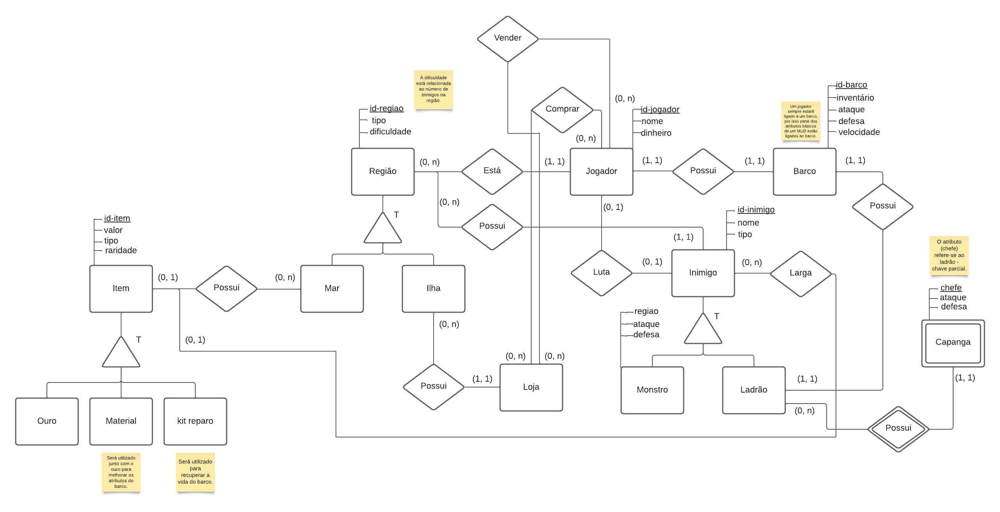

# Diagrama Entidade Relacionamento

    O Diagrama Entidade-Relacionamento (DER) é uma representação visual que mostra a estrutura lógica de um banco de dados. Ele detalha as entidades no sistema, os atributos dessas entidades e as relações entre elas. Este diagrama é essencial no design de bancos de dados relacionais, pois torna mais fácil visualizar e entender as interações entre os diversos componentes do banco de dados.

  
Figura 1: DER Piratas do Caribe MUD game.

  
Fonte: Autores

## Histórico de Versão

| Versão | Data | Descrição | Autor(es) |
| :-: | :-: | :-: | :-: |
| `1.0` | 21/07/2024  | Criação do DER | [Gabriel Souza](https://github.com/GabrielMS00) |
